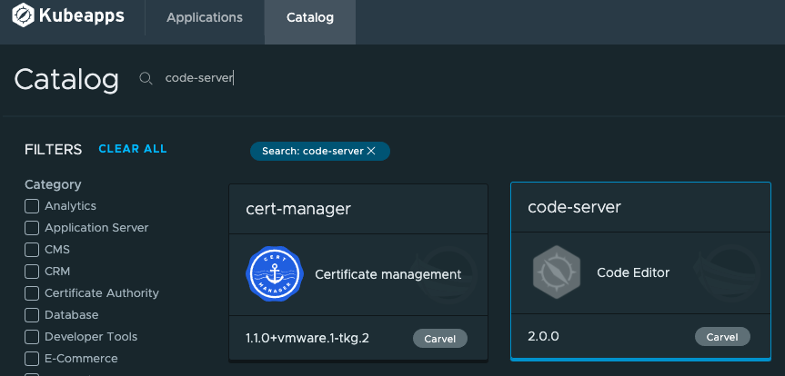

ここではcode-server, Jenkins、ArgoCD、GiteaをPackage化していく。\
通しでやれば分かるが、自動化出来るポイントは多い。
ただしここでは手順確認を主たる目的としているので、自動化しない手順で記載している。
- [基本的な流れ](#基本的な流れ)
  - [オンライン環境](#オンライン環境)
  - [オフライン環境](#オフライン環境)
- [code-serverのパッケージ化](#code-serverのパッケージ化)
  - [オフライン環境へのイメージの持ち込み](#オフライン環境へのイメージの持ち込み)
    - [オンライン環境での作業](#オンライン環境での作業)
    - [オフライン環境での作業](#オフライン環境での作業)
  - [Package化＋PackageRepositoryの作成](#package化packagerepositoryの作成)
    - [Packageの作成](#packageの作成)
    - [PackageRepogitryの作成](#packagerepogitryの作成)
- [Jenkinsのパッケージ化](#jenkinsのパッケージ化)
  - [オフライン環境へのイメージの持ち込み](#オフライン環境へのイメージの持ち込み-1)
    - [オンライン環境での作業](#オンライン環境での作業-1)
    - [オフライン環境での作業](#オフライン環境での作業-1)
  - [Package化＋PackageRepositoryの更新](#package化packagerepositoryの更新)
    - [Packageの作成](#packageの作成-1)
    - [PackageRepogitoryの更新](#packagerepogitoryの更新)
- [ArgoCDのパッケージ化](#argocdのパッケージ化)
  - [オフライン環境へのイメージの持ち込み](#オフライン環境へのイメージの持ち込み-2)
    - [オンライン環境での作業](#オンライン環境での作業-2)
    - [オフライン環境での作業](#オフライン環境での作業-2)
  - [Package化＋PackageRepositoryの作成](#package化packagerepositoryの作成-1)
    - [Packageの作成](#packageの作成-2)
    - [PackageRepogitoryの更新](#packagerepogitoryの更新-1)
- [Giteaのパッケージ化](#giteaのパッケージ化)
  - [オフライン環境へのイメージの持ち込み](#オフライン環境へのイメージの持ち込み-3)
    - [オンライン環境での作業](#オンライン環境での作業-3)
    - [PackageRepogitoryの更新](#packagerepogitoryの更新-2)
- [参考文献](#参考文献)

# 基本的な流れ
## オンライン環境

1. Helm Chartを取得 (helm repo, helm fetch, git clone等)
2. Chartからvalues.yamlを抜き出す (helm inspect values)
3. values.yamlに基本的な設定(TLS, ingressくらい)を設定する
4. Chartをyaml化する (helm template)
5. 以下のyaml template(ytt)を作成する
    - 開発者に変更を許すところを変数化しoverlayするyaml
    - cert-managerに証明書を発行してもらうためのyaml
5. image bundle形式でpublicなイメージリポジトリにuploadする (imgpkg push -b)
6. uploadしたbundleをtarで保存する (imgpkg copy)
7. tarを記録媒体に保存する

6が無駄処理に見えるが、imgpkgコマンドの仕様上、直でtar化出来ないので、一旦publicなイメージリポジトリを経由する必要がある。
5についてはオフライン環境で実施しても問題ない。

## オフライン環境
1. tarをprivateなイメージリポジトリにpushし、かつbundle内のyamlのimageの参照先も書き換える (imgpkg push -b)
2. kubeappが認識するためのPackage(kind:Package, kind:PackageMetadata)を作成する
3. Packageをbundle化してprivateなイメージリポジトリにpushする (imgpkg push -b)
4. クラスタにPackageを認識させるためのPackageRepository(kind:PackageRepository)を作成する
5. PackageRepositoryリソースをクラスタにインストールする


# code-serverのパッケージ化
## オフライン環境へのイメージの持ち込み
### オンライン環境での作業
2022年1月現在、code-serverのhelmのインストール方法はgit cloneする方法になっているため、こちらをベースに進めていく。\
https://coder.com/docs/code-server/latest/helm

Chartを取ってきて、values.yamlを編集する。
```
git clone https://github.com/cdr/code-server
cp -a code-server/ci/helm-chart/values.yaml .
```
編集する内容はTLS対応およびingressの有効化である。\
また、以下のためにannotationにも設定を行う
- cert-managerに証明書を発行してもらう
- websocketを利用する

編集後のvalues.yamlは以下。
```diff
@@ -33,19 +33,18 @@
   port: 8080

 ingress:
-  enabled: false
-  #annotations:
-  #  kubernetes.io/ingress.class: nginx
-  #  kubernetes.io/tls-acme: "true"
-  #hosts:
-  #  - host: code-server.example.loc
-  #    paths:
-  #      - /
-
-  #tls:
-  #  - secretName: code-server
-  #    hosts:
-  #      - code-server.example.loc
+  enabled: true
+  annotations:
+    cert-manager.io/issuer: "code-server-ca-issuer"
+    projectcontour.io/websocket-routes: /
+  hosts:
+    - host: code-server.tkg.tanzu
+      paths:
+        - /
+  tls:
+    - secretName: code-server.tkg.tanzu
+      hosts:
+        - code-server.tkg.tanzu

 # Optional additional arguments
 extraArgs: []
```

次にbundle形式の元になるディレクトリを用意する。\
bundle形式については以下を参照。\
https://carvel.dev/imgpkg/docs/latest/resources/#bundle

今回は以下のディレクトリとして、config以下にyamlを入れていく。
```
bundle/
├── .imgpkg/
└── config/
```

さっそく、ディレクトリを作成してベースとなるyamlを保存する。
```sh
mkdir -p bundle/.imgpkg bundle/config
helm template code-server ./code-server/ci/helm-chart/ -f values.yaml  > ./bundle/config/code-server.yaml
```

code-server.yamlの中を確認し、開発者に変更を許す箇所やその他変更したい箇所を決める。\
ここでは以下の変更を適用することにする。
- namespaceの変更許可
- default passwordの変更許可
- hostnameの変更許可
- テスト用Pod(code-server-test-connection)の削除

overlay.yamlは以下。passwordはbase64でencodeする必要があるので、base64モジュールを使っている。
```yaml:overlay.yaml
#@ load("@ytt:overlay", "overlay")
#@ load("@ytt:data", "data")
#@ load("@ytt:base64", "base64")

apiVersion: v1
kind: Namespace
metadata:
 name: #@ data.values.namespace
---
#@overlay/match by=overlay.not_op(overlay.subset({"kind":"Namespace"})),expects="1+"
---
metadata:
 #@overlay/match missing_ok=True
 namespace: #@ data.values.namespace
---
#@overlay/match by=overlay.subset({"kind":"Secret","metadata":{"name":"code-server"}})
---
data:
  password: #@ base64.encode(data.values.code_server_password)
---
#@overlay/match by=overlay.subset({"kind":"Ingress","metadata":{"name":"code-server"}})
---
spec:
  rules:
  #@overlay/match by=overlay.index(0)
  - host: #@ data.values.code_server_host
---
#@overlay/match by=overlay.subset({"kind":"Pod","metadata":{"name":"code-server-test-connection"}})
#@overlay/remove
---
```

次に開発者が変更可能なパラメタをまとめたvalues.yamlを作る。先程の```#@ data.values.xxx```に該当するところをファイルに書き起こす。
OpenAPI v3 schemaを利用するため、```schema/desc```を書いておく。（Package作成時に効いてくる）\
この辺の書き方はyttのバージョンが古いと使えないかもしれないので、通らない場合はyttのバージョンをあげてみることを推奨する。
```yaml:values.yaml
#@data/values-schema
---
#@schema/desc "Namespace"
namespace: code-server
#@schema/desc "Default Password"
code_server_password: "VMware1!"
#@schema/desc "Hostname"
code_server_host: example.com
```
なお、values-schemaのリファレンスは以下を参照。\
https://carvel.dev/ytt/docs/latest/lang-ref-ytt-schema

また、TLS対応用にcert-managerに証明書の発行依頼をするtls.yamlも追加する。
```yaml:tls.yaml
#@ load("@ytt:overlay", "overlay")
#@ load("@ytt:data", "data")

apiVersion: cert-manager.io/v1
kind: Issuer
metadata:
  name: code-server-selfsigned-issuer
  namespace: #@ data.values.namespace
spec:
  selfSigned: { }
---
apiVersion: cert-manager.io/v1
kind: Certificate
metadata:
  name: code-server-ca
  namespace: #@ data.values.namespace
spec:
  commonName: code-server-ca
  isCA: true
  issuerRef:
    kind: Issuer
    name: code-server-selfsigned-issuer
  secretName: code-server-ca
---
apiVersion: cert-manager.io/v1
kind: Issuer
metadata:
  name: code-server-ca-issuer
  namespace: #@ data.values.namespace
spec:
  ca:
    secretName: code-server-ca
```

現時点での構成は以下となった。
```
bundle/
├── .imgpkg/
└── config/
    ├── code-server.yaml  ベースのManifest
    ├── overlay.yaml    ベースのManifestを書き換えるYTT overlay
    ├── tls.yaml        証明書発行用overlay
    └── values.yaml     overlay時に読み込ませる設定値
```

overlayが正しく書けているかを確認するために、一度yttでyamlに変換出来るか確認する。
```sh
ytt -f bundle/config/
```
次にbundle形式で必須のImagesLockリソースを.imgpkg/image.ymlとして作成する。
```sh
ytt -f bundle/config/ | kbld -f - --imgpkg-lock-output bundle/.imgpkg/images.yml
```
なお、このファイルはタグとSHAのマッピング（Lock）をしたもので、タグがlatestになっていたりして意図しないイメージを見に行くのを防ぐ役割を持つ。中は以下のようになっている。
```yaml
---
apiVersion: imgpkg.carvel.dev/v1alpha1
images:
- annotations:
    kbld.carvel.dev/id: busybox:latest
  image: index.docker.io/library/busybox@sha256:5acba83a746c7608ed544dc1533b87c737a0b0fb730301639a0179f9344b1678
- annotations:
    kbld.carvel.dev/id: codercom/code-server:4.0.2
  image: index.docker.io/codercom/code-server@sha256:4de6369f5865c7db250fa25e3e2306ed5a3f0bad922c9392d52c0dd1dd7e4fd6
kind: ImagesLock
```
次に作成したファイルをbundle形式でuploadする。\
imgpkgコマンドはbundle形式内のyamlに記載されたコンテナイメージをファイル出力する機能があるが、その機能はローカルのファイルからは利用できないため、一度リポジトリにbundle形式でpushしておく必要がある。\
push先は自前のPrivate RepositryでもPublicなものでも何でも構わないが、ここではdockerhubを利用した。

```
docker login
imgpkg push -b mydockerrepo/code-server -f ./bundle/
```

次にimgpkgを使ってrイメージをローカルに保存する。サイズが大きいため時間が少し掛かる。
```
imgpkg copy -b mydockerrepo/code-server --to-tar ./code-server.tar
```
以下のcode-serverやbusy-boxを見ると分かるように、イメージをexportしているのが確認できる。
```
copy | exporting 3 images...
copy | will export index.docker.io/codercom/code-server@sha256:4de6369f5865c7db250fa25e3e2306ed5a3f0bad922c9392d52c0dd1dd7e4fd6
copy | will export index.docker.io/mydockerrepo/code-server@sha256:c4317874eecade3b1ae7f725861b1afb38da6aab896c22e080ab5b3a0af6f73a
copy | will export index.docker.io/library/busybox@sha256:5acba83a746c7608ed544dc1533b87c737a0b0fb730301639a0179f9344b1678
```

これでオンライン環境の作業は終了。 tarはそれなりのファイルサイズになるので、空き容量が少ない人は注意。
```sh
$ ls -lh ./code-server.tar
-rw-rw-r-- 1 tkg tkg 1.9G  1月 28 11:48 ./code-server.tar
```
### オフライン環境での作業
先程作成したtarをUSBメモリやDVD-Rなどを利用してオフライン環境に持ち込む。\
持ち込んだtarファイルをPrivate Repositry(ここではHarbor)にPushする。ここではタグは不要。
```
imgpkg copy --tar ./code-server.tar --to-repo oss-harbor.tkg.tanzu/my-project/code-server/bundle --registry-ca-cert-path ~/ca.crt
```
この時に先ほど作成した.imgpkg/images.ymlの中が書き換わる。
書き換わった内容を確認するために、Harborからbundleを取り出して、images.ymlを見てみる。
```
imgpkg pull -b oss-harbor.tkg.tanzu/my-project/code-server/bundle -o /tmp/bundle --registry-ca-cert-path ~/ca.crt
cat /tmp/bundle/.imgpkg/images.yml
```
結果はこちら。
```yaml
---
apiVersion: imgpkg.carvel.dev/v1alpha1
images:
- annotations:
    kbld.carvel.dev/id: busybox:latest
  image: oss-harbor.tkg.tanzu/my-project/code-server/bundle@sha256:5acba83a746c7608ed544dc1533b87c737a0b0fb730301639a0179f9344b1678
- annotations:
    kbld.carvel.dev/id: codercom/code-server:4.0.2
  image: oss-harbor.tkg.tanzu/my-project/code-server/bundle@sha256:4de6369f5865c7db250fa25e3e2306ed5a3f0bad922c9392d52c0dd1dd7e4fd6
kind: ImagesLock
```
最初に作ったファイルと比較するとよく分かる。
```diff
@@ -3,8 +3,8 @@
 images:
 - annotations:
     kbld.carvel.dev/id: busybox:latest
-  image: index.docker.io/library/busybox@sha256:5acba83a746c7608ed544dc1533b87c737a0b0fb730301639a0179f9344b1678
+  image: oss-harbor.tkg.tanzu/my-project/code-server/bundle@sha256:5acba83a746c7608ed544dc1533b87c737a0b0fb730301639a0179f9344b1678
 - annotations:
     kbld.carvel.dev/id: codercom/code-server:4.0.2
-  image: index.docker.io/codercom/code-server@sha256:4de6369f5865c7db250fa25e3e2306ed5a3f0bad922c9392d52c0dd1dd7e4fd6
+  image: oss-harbor.tkg.tanzu/my-project/code-server/bundle@sha256:4de6369f5865c7db250fa25e3e2306ed5a3f0bad922c9392d52c0dd1dd7e4fd6
 kind: ImagesLock
 ```

デプロイの時に使われるManifestは以下で確認できる。
```
 ytt -f /tmp/bundle/config/ | kbld -f /tmp/bundle/.imgpkg/ -f -
```
## Package化＋PackageRepositoryの作成
### Packageの作成
ディレクトリ構成はPackageRepositoryを意識して以下のようにする。
```
packages/
└── code-server/
    ├── metadata.yaml     packageのメタ情報(表示名など)を記載
    └── 2.0.0/
        └── package.yaml  packageの定義
```
以下で作成。
```sh
mkdir -p packages/code-server/2.0.0
```

先にPackageMetadataから作成する。
以下にPackageMetadataの雛形があるので、コピーして自分好みに書き換える。
https://carvel.dev/kapp-controller/docs/latest/packaging-tutorial/#creating-the-custom-resources
ちなみに一点大きな注意点として、名前に関する制限がある。
>When creating this CR, the api will validate that the PackageMetadata’s name is a fully qualified name: It must have at least three segments separated by . and cannot have a trailing ..

ドットで分離された少なくとも3つのセグメントが必要で、ドットで終わるのはNGとある。名前をつける際は注意。

各項目の意味は以下を参照。
https://carvel.dev/kapp-controller/docs/latest/packaging/#package-metadata
```iconSVGBase64```を適切に設定すると、kubeappsで利用する際にアイコンが表示されるので、見栄えを気にする場合はここも記載する。\
作成したmetadata.yamlがこちら。
```yaml
apiVersion: data.packaging.carvel.dev/v1alpha1
kind: PackageMetadata
metadata:
  name: code-server.tkg.tanzu
spec:
  displayName: "code-server"
  longDescription: "Code Editor similar to VSCode"
  shortDescription: "Code Editor"
  providerName: IT Dept.
  maintainers:
  - name: John Doe
  categories:
    - "IDE"
  supportDescription: "The detailed documentation is on https://github.com/coder/code-server/tree/main/docs.  Support is available from the community."
  ```

次にPackageを作成するのだが、一度テンプレートを作ってからvalues.yamlのパラメタを引っ張るような形で最終形に仕上げていく。\
こちらもPackageMetadataの雛形と同じサイトに雛形があるので、まずはそちらをコピーして書き換える。
また、こちらも制約があるので注意。
>There will also be validations run on the Package CR, so ensure that spec.refName and spec.version are not empty and that metadata.name is <spec.refName>.<spec.version>. These validations are done to encourage a naming scheme that keeps package version names unique.

- spec.refNameとspec.versionが空でないこと
- metadata.nameが<spec.refName>.<spec.version>の形式になっていること\
https://carvel.dev/kapp-controller/docs/latest/package-consumer-concepts/#constraints


また、バージョンに関してはこちらでは書かれていないが、以下でsemver形式(x.y.z)になっていないとダメだと記載があり、実際守らないと動かない点に注意。
> This constraints property is based on semver ranges and more details on conditions that can be included with constraints can be found [here](https://github.com/blang/semver#ranges).

作成したPackageのテンプレート(package-template.yaml)は以下。
```yaml
#@ load("@ytt:data", "data")
#@ load("@ytt:yaml", "yaml")
---
apiVersion: data.packaging.carvel.dev/v1alpha1
kind: Package
metadata:
  name: #@ "code-server.tkg.tanzu." + data.values.version
spec:
  refName: code-server.tkg.tanzu
  version: #@ data.values.version
  releaseNotes: |
        Initial release of code-server for Air-gapped env
  valuesSchema:
    openAPIv3: #@ yaml.decode(data.values.openapi)["components"]["schemas"]["dataValues"]
  template:
    spec:
      fetch:
      - imgpkgBundle:
          image: oss-harbor.tkg.tanzu/my-project/code-server/bundle@sha256:c4317874eecade3b1ae7f725861b1afb38da6aab896c22e080ab5b3a0af6f73a
      template:
      - ytt:
          paths:
          - "./config"
      - kbld:
          paths:
          - "-"
          - ".imgpkg/images.yml"
      deploy:
      - kapp: {}
```

imgpkgBundleは先程--to-repoでtarから登録したbundleを指定する。\
SHAの値が分からない場合はpullしなおせば標準出力から取得できる。\
nameの+の前のFQDNは最後にドットがついている点に注意。（設定しないとPackageRepository側で想定している命名ルールとずれてPackageRepositryのReconcileに失敗する）

```yaml.decode(data.values.openapi)["components"]["schemas"]["dataValues"]```が味噌で、これでvalues.yamlの```#@schema/desc```を元に勝手にvalue schemaを作ってくれる。

このテンプレートを元に、package.yamlを作っていく。
まず、values.yamlをOpenAPI形式に変換する。
```
ytt -f /tmp/bundle/config/values.yaml --data-values-schema-inspect -o openapi-v3 > schema-openapi.yml
```
具体的にどのような変換を行っているかは以下のURLで確認できる。
https://carvel.dev/ytt/docs/latest/how-to-export-schema

変換後、先程作ったテンプレートにvaluesとvalue schemaの内容を反映させて保存する。
```
ytt -f ./package-template.yaml --data-value-file openapi=./schema-openapi.yml -v version="2.0.0" > packages/code-server/2.0.0/package.yaml
```
中を確認すると、valuesSchemaに説明が入っていることが分かる。\
以上でパッケージ作成は終了。

### PackageRepogitryの作成
PackageRepogitryは以下のような構成する必要がある(requiredのみ抜粋)。\
```
repo/
├── .imgpkg/
└── packages/
```
※出典元：https://carvel.dev/kapp-controller/docs/latest/packaging-artifact-formats/#package-repository-bundle

packagesディレクトリはPackage作成時に作成済みなので、配置し直す。
```
mkdir -p repo/.imgpkg
mv packages/ repo/
```

作ったRepositoryをbundle化してHarborにpushする。
```
kbld -f ./repo/packages/ --imgpkg-lock-output repo/.imgpkg/images.yml --registry-ca-cert-path ~/ca.crt
imgpkg push -b oss-harbor.tkg.tanzu/my-packages/dev-repo:1.0.0 -f repo/ --registry-ca-cert-path ~/ca.crt
```

これでPackageRepogitryとしては作成完了だが、クラスタは認識していないので、PackageRepogitryリソースを作成してクラスタに認識させる。\
以下にひな形があるので、コピーしてリソースを作成する。\
https://carvel.dev/kapp-controller/docs/latest/packaging-tutorial/#adding-a-packagerepository\
ただし、上記手順だとimageをpullする際の認証の指定方法が書いていない。
認証付きでやる場合はこちらの方を参照。\
https://carvel.dev/kapp-controller/docs/latest/private-registry-auth/\
ここでは一番原始的な方法で実施する。
\
以下のようなSecretを作成する。認証情報は複数書くと後で動作しなくなるので、1つのみ記載すること。
```yaml
---
apiVersion: v1
kind: Secret
metadata:
  name: myimagerepo
  annotations:
    secretgen.carvel.dev/image-pull-secret: ""
type: kubernetes.io/dockerconfigjson
stringData:
  .dockerconfigjson: |
    {
      "auths": {
        "oss-harbor.tkg.tanzu": {
          "username": "user",
          "password": "xxxx",
          "auth": ""
        }
      }
    }
```
作成したsecretのyamlを適用する。
```
kubectl apply -f ./secret.yaml
```
このapplyしたsecretを参照するPackageRepositoryリソースを作成する。
```yaml
apiVersion: packaging.carvel.dev/v1alpha1
kind: PackageRepository
metadata:
  name: dev-repo
spec:
  fetch:
    imgpkgBundle:
      image: oss-harbor.tkg.tanzu/my-packages/dev-repo:1.0.0
      secretRef:
        name: myimagerepo
```
作ったリソースをapplyして、中身を見てみる。
```
kubectl apply -f repo.yaml
kubectl get packagerepositories.packaging.carvel.dev
```
kapp-controllerがPackageRepositoryに記載されたbundleを取得しに行く。\
問題なければしばらくすると以下が表示される。
```
NAME        AGE     DESCRIPTION
dev-repo    9m44s   Reconcile succeeded

```
tanzuコマンドからも確認できる。
```
$ tanzu package repository list -A
/ Retrieving repositories...
  NAME            REPOSITORY                                                          STATUS               DETAILS  NAMESPACE
  dev-repo        oss-harbor.tkg.tanzu/my-packages/dev-repo:1.0.0                     Reconcile succeeded           default
  tanzu-standard  oss-harbor.tkg.tanzu/tkg/packages/standard/repo:v1.4.0              Reconcile succeeded           tanzu-package-repo-global
  tanzu-core      oss-harbor.tkg.tanzu/tkg/packages/core/repo:v1.21.2_vmware.1-tkg.1  Reconcile succeeded           tkg-system
```
```
$ tanzu package available list code-server.tkg.tanzu
| Retrieving package versions for code-server.tkg.tanzu...
  NAME                   VERSION  RELEASED-AT
  code-server.tkg.tanzu  2.0.0
  ```

※repositoryの追加もtanzuコマンドから可能だが、secretの指定が出来ないため、今回は割愛。

kubeappsからも確認可能。
  

# Jenkinsのパッケージ化
基本的にはcode-serverと同じなので、差がある点を中心に記載する。
## オフライン環境へのイメージの持ち込み
bitnami版のJenkinsの利用を当初想定していたが、実際進めるとkubernetes pluginの動作が怪しく、agentがJenkinsと通信するところがすんなり進まなかったため、オフィシャルのHelmを利用する。

### オンライン環境での作業
values.yamlを取得する。
```
helm repo add jenkins https://charts.jenkins.io
helm inspect values jenkins/jenkins > values.yaml
```

TLS化、Ingress、テストPodの停止をvalues.yamlで設定する。
```diff
@@ -417,7 +417,7 @@
   updateStrategy: {}

   ingress:
-    enabled: false
+    enabled: true
     # Override for the default paths that map requests to the backend
     paths: []
     # - backend:
@@ -432,7 +432,8 @@
     # For Kubernetes v1.19+, use 'networking.k8s.io/v1'
     apiVersion: "extensions/v1beta1"
     labels: {}
-    annotations: {}
+    annotations:
+      cert-manager.io/issuer: jenkins-ca-issuer
     # kubernetes.io/ingress.class: nginx
     # kubernetes.io/tls-acme: "true"
     # For Kubernetes >= 1.18 you should specify the ingress-controller via the field ingressClassName
@@ -441,11 +442,11 @@
     # Set this path to jenkinsUriPrefix above or use annotations to rewrite path
     # path: "/jenkins"
     # configures the hostname e.g. jenkins.example.com
-    hostName:
+    hostName: jenkins.example.com
     tls:
-    # - secretName: jenkins.cluster.local
-    #   hosts:
-    #     - jenkins.cluster.local
+    - secretName: jenkins.cluster.local
+      hosts:
+        - jenkins.cluster.local

   # often you want to have your controller all locked down and private
   # but you still want to get webhooks from your SCM
@@ -523,7 +524,7 @@
     prometheusRuleNamespace: ""

   # Can be used to disable rendering controller test resources when using helm template
-  testEnabled: true
+  testEnabled: false

   httpsKeyStore:
     jenkinsHttpsJksSecretName: ''
```
hostNameは空だと項目がつくられないので、適当なものを埋めておく。
保存場所を作成する。
```
mkdir -p bundle/.imgpkg bundle/config
```

ベースのyamlを出力する。
```
helm template -f ./values.yaml jenkins jenkins/jenkins > bundle/config/jenkins.yaml
```
overlayを作成する。
```yaml
#@ load("@ytt:overlay", "overlay")
#@ load("@ytt:data", "data")
#@ load("@ytt:base64", "base64")

apiVersion: v1
kind: Namespace
metadata:
 name: #@ data.values.namespace
---
#@overlay/match by=overlay.not_op(overlay.subset({"kind":"Namespace"})),expects="1+"
---
metadata:
 #@overlay/match missing_ok=True
 namespace: #@ data.values.namespace
---
#@overlay/match by=overlay.subset({"kind":"Secret","metadata":{"name":"jenkins"}})
---
data:
  jenkins-admin-password: #@ base64.encode(data.values.jenkins_password)
---
#@overlay/match by=overlay.subset({"kind":"RoleBinding"}),expects="1+"
---
subjects:
  #@overlay/match by="name"
  - name: jenkins
    namespace: #@ data.values.namespace
---
#@overlay/match by=overlay.subset({"kind":"Ingress","metadata":{"name":"jenkins"}})
---
spec:
  rules:
  #@overlay/match by=overlay.index(0)
  - host: #@ data.values.jenkins_host
  tls:
  - hosts: #@ data.values.jenkins_host
  secretName: #@ data.values.jenkins_host
```
namespaceがRoleBindingにもあるので、その点は注意。
values.yamlは以下。
```yaml
#@data/values-schema
---
#@schema/desc "Namespace"
namespace: jenkins
#@schema/desc "Default Password"
jenkins_password: "VMware1!"
#@schema/desc "Hostname"
jenkins_host: example.com
```
tls.yamlは以下。
```yaml
#@ load("@ytt:overlay", "overlay")
#@ load("@ytt:data", "data")

apiVersion: cert-manager.io/v1
kind: Issuer
metadata:
  name: jenkins-selfsigned-issuer
  namespace: #@ data.values.namespace
spec:
  selfSigned: { }
---
apiVersion: cert-manager.io/v1
kind: Certificate
metadata:
  name: jenkins-ca
  namespace: #@ data.values.namespace
spec:
  commonName: jenkins-ca
  isCA: true
  issuerRef:
    kind: Issuer
    name: jenkins-selfsigned-issuer
  secretName: jenkins-ca
---
apiVersion: cert-manager.io/v1
kind: Issuer
metadata:
  name: jenkins-ca-issuer
  namespace: #@ data.values.namespace
spec:
  ca:
    secretName: jenkins-ca
```

bundle化してイメージをダウンロードする。
```
ytt -f bundle/config/ | kbld -f - --imgpkg-lock-output bundle/.imgpkg/images.yml
docker login
imgpkg push -b mydockerrepo/jenkins -f ./bundle/
imgpkg copy -b mydockerrepo/jenkins --to-tar ./jenkins.tar
```

### オフライン環境での作業

tarをPrivateリポジトリに登録し、/tmp/bundleに展開する。
```
imgpkg copy --tar ./jenkins.tar --to-repo oss-harbor.tkg.tanzu/my-project/jenkins/bundle --registry-ca-cert-path ~/ca.crt
imgpkg pull -b oss-harbor.tkg.tanzu/my-project/jenkins/bundle -o /tmp/bundle --registry-ca-cert-path ~/ca.crt
```

## Package化＋PackageRepositoryの更新
### Packageの作成
作業ディレクトリを作成。packagesまではcode-serverと同じディレクトリを利用。
```
cd repo/
mkdir -p packages/jenkins/2.319.1
```

最初にPackageMetadata(packages/jenkins/metadata.yaml)を作成。
```
$ cat packages/jenkins/metadata.yaml
apiVersion: data.packaging.carvel.dev/v1alpha1
kind: PackageMetadata
metadata:
  name: jenkins.tkg.tanzu
spec:
  displayName: "jenkins"
  longDescription: "CI/CD Pipeline"
  shortDescription: "CI/CD"
  providerName: IT Dept.
  maintainers:
  - name: John Doe
  categories:
    - "CICD"
```
次にtemplateを作成。
```yaml
cd ../template/
cat <<EOF > ./jenkins-template.yaml
#@ load("@ytt:data", "data")
#@ load("@ytt:yaml", "yaml")
---
apiVersion: data.packaging.carvel.dev/v1alpha1
kind: Package
metadata:
  name: #@ "jenkins.tkg.tanzu." + data.values.version
spec:
  refName: jenkins.tkg.tanzu
  version: #@ data.values.version
  releaseNotes: |
        Initial release of Jenkins for Air-gapped env
  valuesSchema:
    openAPIv3: #@ yaml.decode(data.values.openapi)["components"]["schemas"]["dataValues"]
  template:
    spec:
      fetch:
      - imgpkgBundle:
          image: oss-harbor.tkg.tanzu/my-project/jenkins/bundle@sha256:c4317874eecade3b1ae7f725861b1afb38da6aab896c22e080ab5b3a0af6f73a
      template:
      - ytt:
          paths:
          - "./config"
      - kbld:
          paths:
          - "-"
          - ".imgpkg/images.yml"
      deploy:
      - kapp: {}
EOF
```
テンプレートからPackageを生成。
```
ytt -f /tmp/bundle/config/values.yaml --data-values-schema-inspect -o openapi-v3 > jenkins-schema-openapi.yml
ytt -f ./jenkins-template.yaml --data-value-file openapi=./jenkins-schema-openapi.yml -v version="2.319.1" > ../repo/packages/jenkins/2.319.1/package.yaml
```

### PackageRepogitoryの更新

PackageRepositoryのバージョンを変更してpushしなおす。
```
kbld -f ./repo/packages/ --imgpkg-lock-output repo/.imgpkg/images.yml --registry-ca-cert-path ~/ca.crt
imgpkg push -b oss-harbor.tkg.tanzu/my-packages/dev-repo:1.0.1 -f repo/ --registry-ca-cert-path ~/ca.crt
```
PackageRepositoryリソースを更新する。
```yaml
cat <<EOF > ./repo.yaml
apiVersion: packaging.carvel.dev/v1alpha1
kind: PackageRepository
metadata:
  name: dev-repo
spec:
  fetch:
    imgpkgBundle:
      image: oss-harbor.tkg.tanzu/my-packages/dev-repo:1.0.1
      secretRef:
        name: myimagerepo
EOF
kubectl apply -f repo.yaml
```

更新が終わったことを確認し、利用可能なリストの中にjenkinsがいることを確認する。
```
kubectl get packagerepositories.packaging.carvel.dev
tanzu package available list jenkins.tkg.tanzu
```

# ArgoCDのパッケージ化

## オフライン環境へのイメージの持ち込み
### オンライン環境での作業
helmからvalues.yamlを取得。
```
helm repo add bitnami https://charts.bitnami.com/bitnami
helm inspect values bitnami/argo-cd > values.yaml
```
values.yamlを書き換えていくのだが、ファイルサイズが大きいため、パラメタを探す際は注意。
values.yamlの変更箇所は以下。
```yaml
@@ -515,7 +515,7 @@
   ## Redirect all request to https
   ## @param server.insecure Disable HTTPS redirection for Argo CD server
   ##
-  insecure: false
+  insecure: true

   ## @param server.logFormat ArgoCD server logs format. Options: [text, json]
   ##
@@ -605,7 +605,7 @@
   ingress:
     ## Set to true to enable ingress record generation
     ##
-    enabled: false
+    enabled: true

     ## @param server.ingress.selfSigned Create a TLS secret for this ingress record using self-signed certificates generated by Helm
     ##
@@ -642,13 +642,13 @@
     ##   kubernetes.io/ingress.class: nginx
     ##   cert-manager.io/cluster-issuer: cluster-issuer-name
     ##
-    annotations: {}
-
+    annotations:
+      cert-manager.io/issuer: "argocd-ca-issuer"
     ## Enable TLS configuration for the hostname defined at ingress.hostname parameter
     ## TLS certificates will be retrieved from a TLS secret with name: {{- printf "%s-tls" .Values.ingress.hostname }}
     ## You can use the ingress.secrets parameter to create this TLS secret or relay on cert-manager to create it
     ##
-    tls: false
+    tls: true

     ## The list of additional hostnames to be covered with this ingress record.
     ## Most likely the hostname above will be enough, but in the event more hosts are needed, this is an array
@@ -754,7 +754,7 @@
   ingressGrpc:
     ## Set to true to enable ingress record generation
     ##
-    enabled: false
+    enabled: true

     ## @param server.ingressGrpc.selfSigned Create a TLS secret for this ingress record using self-signed certificates generated by Helm
     ##
@@ -791,13 +791,13 @@
     ##   kubernetes.io/ingress.class: nginx
     ##   cert-manager.io/cluster-issuer: cluster-issuer-name
     ##
-    annotations: {}
-
+    annotations:
+      cert-manager.io/issuer: "grpc-argocd-ca-issuer"
     ## Enable TLS configuration for the hostname defined at ingress.hostname parameter
     ## TLS certificates will be retrieved from a TLS secret with name: {{- printf "%s-tls" .Values.ingress.hostname }}
     ## You can use the ingress.secrets parameter to create this TLS secret or relay on cert-manager to create it
     ##
-    tls: false
+    tls: true

     ## The list of additional hostnames to be covered with this ingress record.
     ## Most likely the hostname above will be enough, but in the event more hosts are needed, this is an array
@@ -1117,7 +1117,8 @@
     externalTrafficPolicy: Cluster
     ## @param repoServer.service.annotations Additional custom annotations for Repo server service
     ##
-    annotations: {}
+    annotations:
+      projectcontour.io/upstream-protocol.h2c: https,443

   ## Argo CD repo server log format: text|json
   ## @param repoServer.logFormat Format for the Argo CD repo server logs. Options: [text, json]
@@ -1751,7 +1752,7 @@
     ## Argo admin password
     ## @param config.secret.argocdServerAdminPassword Argo CD server admin password. Autogenerated by default.
     ##
-    argocdServerAdminPassword: ""
+    argocdServerAdminPassword: "password"
     ## Password modification time defaults to current time if not set
     ## @param config.secret.argocdServerAdminPasswordMtime Argo CD server password modification time
     ## E.g:
@@ -1911,6 +1912,7 @@
     ## Password key to be retrieved from Redis&trade; secret
     ##
     existingSecretPasswordKey: 'redis-password'
+    password: "password"

   ## Cluster settings
   ## @disabled-param redis.architecture Redis dependency architecture. Either 'standalone' or 'replicaset'
```
passwordはbcrypt化されたものをyaml内に保持するため、yttでoverlayする場合はbcrypt化したものを与える必要がある。
yttのモジュールでbcryptがないため、ここでは初期パスワードはoverlayせず固定とする。\
どうしてもbcrypt化した値を渡したし場合は、以下のサイトなどでbcrypt化した値を取得してoverlayすると良い。
https://www.browserling.com/tools/bcrypt
\
また、gRPCとServiceを共有するため、Ingressのhost


作業ディレクトリを作成してbundle化していく。
```
mkdir -p bundle/.imgpkg bundle/config
helm template argo-cd bitnami/argo-cd  -f values.yaml  > ./bundle/config/argocd.yaml
```
overlay.yamlは以下の通り。
```yaml
cat <<EOF > bundle/config/overlay.yaml
#@ load("@ytt:overlay", "overlay")
#@ load("@ytt:data", "data")
#@ load("@ytt:base64", "base64")

apiVersion: v1
kind: Namespace
metadata:
 name: #@ data.values.namespace
---
#@overlay/match by=overlay.not_op(overlay.subset({"kind":"Namespace"})),expects="1+"
---
metadata:
 #@overlay/match missing_ok=True
 namespace: #@ data.values.namespace
---
#@overlay/match by=overlay.subset({"kind":"Ingress","metadata":{"name":"argo-cd-server"}})
---
spec:
  rules:
  #@overlay/match by=overlay.index(0)
  - host: #@ data.values.argocd_host
  tls:
  #@overlay/match by=overlay.index(0)
  - hosts:
    #@overlay/match by=overlay.index(0)
    - #@ data.values.argocd_host
    secretName: #@ data.values.argocd_host
---
#@overlay/match by=overlay.subset({"kind":"Ingress","metadata":{"name":"argo-cd-server-grpc"}})
---
spec:
  rules:
  #@overlay/match by=overlay.index(0)
  - host: #@ data.values.argocd_grpc_host
  tls:
  #@overlay/match by=overlay.index(0)
  - hosts:
    #@overlay/match by=overlay.index(0)
    - #@ data.values.argocd_grpc_host
    secretName: #@ data.values.argocd_grpc_host
---
#@overlay/match by=overlay.subset({"kind":"ClusterRoleBinding"}),expects="1+"
---
subjects:
  #@overlay/match by="kind"
  - kind: ServiceAccount
    namespace: #@ data.values.namespace
---
#@overlay/match by=overlay.subset({"kind":"Deployment","metadata":{"name":"argo-cd-server"}})
---
spec:
  template:
    spec:
      affinity:
        podAntiAffinity:
          preferredDuringSchedulingIgnoredDuringExecution:
          #@overlay/match by=overlay.index(0)
          - podAffinityTerm:
              namespaces:
              #@overlay/match by=overlay.index(0)
              - #@ data.values.namespace
---
#@overlay/match by=overlay.subset({"kind":"Service","metadata":{"name":"argo-cd-server"}})
---
metadata:
  #@overlay/match missing_ok=True
  #@overlay/match-child-defaults missing_ok=True
  annotations:
    projectcontour.io/upstream-protocol.h2c: https,443
---
#@overlay/match by=overlay.subset({"kind":"Ingress","metadata":{"name":"argo-cd-server"}})
---
metadata:
  #@overlay/match missing_ok=True
  #@overlay/match-child-defaults missing_ok=True
  annotations:
    cert-manager.io/issuer: "argo-cd-ca-issuer"
spec:
  rules:
  #@overlay/match by=overlay.index(0)
  - http:
      paths:
      #@overlay/match by=overlay.index(0)
      - backend:
          service:
            #@overlay/match
            name: argo-cd-server
            port:
              #@overlay/match
              name: http
---
#@overlay/match by=overlay.subset({"kind":"Ingress","metadata":{"name":"argo-cd-server-grpc"}})
---
metadata:
  #@overlay/match missing_ok=True
  #@overlay/match-child-defaults missing_ok=True
  annotations:
    cert-manager.io/issuer: "argo-cd-ca-issuer"
---
#@overlay/match by=overlay.subset({"kind":"StatefulSet","metadata":{"name":"argo-cd-redis-replicas"}})
---
spec:
  template:
    spec:
      containers:
      #@overlay/match by="name"
      - name: redis
        env:
        #@overlay/match by="name"
        - name: REDIS_MASTER_HOST
          value: #@ "argo-cd-redis-master-0.argo-cd-redis-headless." + data.values.namespace + ".svc.cluster.local"
EOF
```
ポイントは以下。
- gRPCとserverでIngressの転送ポートを分けてあげる
- namespaceを持っている箇所がかなりあるので、default以外のNamespaceでdryrunしてdefaultでgrepして、該当箇所を書き換える
- gRPCの通信はHTTP/2なので、```Kind:Service```でHTTP/2のままエンドポイントに渡すように設定\
（annotationの詳細については[こちら](https://projectcontour.io/docs/main/config/annotations/#contour-specific-httpproxy-annotations)を参照）

また、デバッグの都合でIngressのcert-managerのためのannotationsをoverlay.yamlで設定しているが、helm側で設定してもよい。（その場合はIssuerの名前が変えられないので注意）

以下はTLSのoverlay。IssuerはgRPCもserverも同じ。
```yaml
cat <<EOF > bundle/config/tls.yaml
#@ load("@ytt:overlay", "overlay")
#@ load("@ytt:data", "data")

apiVersion: cert-manager.io/v1
kind: Issuer
metadata:
  name: argo-cd-selfsigned-issuer
  namespace: #@ data.values.namespace
spec:
  selfSigned: { }
---
apiVersion: cert-manager.io/v1
kind: Certificate
metadata:
  name: argo-cd-ca
  namespace: #@ data.values.namespace
spec:
  commonName: argo-cd-ca
  isCA: true
  issuerRef:
    kind: Issuer
    name: argo-cd-selfsigned-issuer
  secretName: argo-cd-ca
---
apiVersion: cert-manager.io/v1
kind: Issuer
metadata:
  name: argo-cd-ca-issuer
  namespace: #@ data.values.namespace
spec:
  ca:
    secretName: argo-cd-ca
EOF
```
values.yamlは以下。
```yaml
#@data/values-schema
---
#@schema/desc "Namespace"
namespace: argo-cd
#@schema/desc "Hostname"
argocd_host: example.com
#@schema/desc "gRPC Hostname"
argocd_grpc_host: grpc.example.com
```

bundle化からtar化までは一気に行う。
```sh
ytt -f bundle/config/ | kbld -f - --imgpkg-lock-output bundle/.imgpkg/images.yml
docker login
imgpkg push -b mydockerrepo/argo-cd -f ./bundle/
imgpkg copy -b mydockerrepo/argo-cd --to-tar ./argo-cd.tar
```

### オフライン環境での作業
tarをプライベートリポジトリに取り込む。
```
imgpkg copy --tar ./argo-cd.tar --to-repo oss-harbor.tkg.tanzu/my-project/argo-cd/bundle --registry-ca-cert-path ~/ca.crt
imgpkg pull -b oss-harbor.tkg.tanzu/my-project/argo-cd/bundle -o /tmp/bundle --registry-ca-cert-path ~/ca.crt
```
## Package化＋PackageRepositoryの作成
### Packageの作成
ディレクトリの作成。
```
mkdir -p repo/packages/argo-cd/2.0.14
```
PackageMetadataの作成。
```yaml
cat <<EOF > repo/packages/argo-cd/metadata.yaml
apiVersion: data.packaging.carvel.dev/v1alpha1
kind: PackageMetadata
metadata:
  name: argo-cd.tkg.tanzu
spec:
  displayName: "Argo CD"
  longDescription: "Deploy tool for Kubernetes"
  shortDescription: "GitOps"
  providerName: IT Dept.
  maintainers:
  - name: John Doe
  categories:
    - "CICD"
EOF
```

Packageのテンプレートを作成。SHAは先程pullした時の値を貼り付ける。
```yaml
cat <<EOF > ./template/argocd-template.yaml
#@ load("@ytt:data", "data")
#@ load("@ytt:yaml", "yaml")
---
apiVersion: data.packaging.carvel.dev/v1alpha1
kind: Package
metadata:
  name: #@ "argo-cd.tkg.tanzu." + data.values.version
spec:
  refName: argo-cd.tkg.tanzu
  version: #@ data.values.version
  releaseNotes: |
        Initial release of Argo CD for Air-gapped env
  valuesSchema:
    openAPIv3: #@ yaml.decode(data.values.openapi)["components"]["schemas"]["dataValues"]
  template:
    spec:
      fetch:
      - imgpkgBundle:
          image: oss-harbor.tkg.tanzu/my-project/argo-cd/bundle@sha256:a282119c51d1f7d1434e988c8f70c8c4fd1ba3ff8816abb7298217a3a4e07b60
      template:
      - ytt:
          paths:
          - "./config"
      - kbld:
          paths:
          - "-"
          - ".imgpkg/images.yml"
      deploy:
      - kapp: {}
EOF
```
Packageのmanifestを作成する。
```
ytt -f /tmp/bundle/config/values.yaml --data-values-schema-inspect -o openapi-v3 > ./template/argo-cd-schema-openapi.yml
ytt -f ./template/argocd-template.yaml --data-value-file openapi=./template/argo-cd-schema-openapi.yml -v version="2.0.14" > ./repo/packages/argo-cd/2.0.14/package.yaml
```

### PackageRepogitoryの更新
PackageRepositoryのバージョンを変更してpushしなおす。
```
kbld -f ./repo/packages/ --imgpkg-lock-output repo/.imgpkg/images.yml --registry-ca-cert-path ~/ca.crt
imgpkg push -b oss-harbor.tkg.tanzu/my-packages/dev-repo:1.0.2 -f repo/ --registry-ca-cert-path ~/ca.crt
```
今回はpatchコマンドで更新する。custom resourceなので、typeがデフォルトのstrategicでは通らない。なのでmergeに変更して実行する必要がある。
```
kubectl patch packagerepository dev-repo --type=merge --patch '{"spec": {"fetch": {"imgpkgBundle": {"image": "oss-harbor.tkg.tanzu/my-packages/dev-repo:1.0.2"}}}}'
```
しばらく待つと```kubectl get packagerepository -o yaml``` の```status.fetch.updatedAt```が更新される。\
更新された後にpackageとして見えているかも確認する。
```
kubectl get packagerepositories.packaging.carvel.dev
tanzu package available list 
```


# Giteaのパッケージ化

## オフライン環境へのイメージの持ち込み
GiteaもBitnamiで提供されていないので[オフィシャル手順](https://gitea.com/gitea/helm-chart/)から引っ張ってくる。

### オンライン環境での作業
helmのvalues.yamlを取得。
```
helm repo add gitea-charts https://dl.gitea.io/charts/
helm repo update
helm inspect values gitea-charts/gitea > ./values.yaml
```
values.yamlの変更点は以下。
```diff
@@ -64,9 +64,10 @@
     annotations:

 ingress:
-  enabled: false
+  enabled: true
   # className: nginx
-  annotations: {}
+  annotations:
+    cert-manager.io/issuer: gitea-ca-issuer
     # kubernetes.io/ingress.class: nginx
     # kubernetes.io/tls-acme: "true"
   hosts:
@@ -74,10 +75,10 @@
       paths:
         - path: /
           pathType: Prefix
-  tls: []
-  #  - secretName: chart-example-tls
-  #    hosts:
-  #      - git.example.com
+  tls:
+   - secretName: chart-example-tls
+     hosts:
+       - git.example.com
   # Mostly for argocd or any other CI that uses `helm template | kubectl apply` or similar
   # If helm doesn't correctly detect your ingress API version you can set it here.
   # apiVersion: networking.k8s.io/v1
```
なお、checkDeprecationはgiteaが起動しているかの確認用Pod("gitea-test-connection")を生成するパラメタっぽいが、true/falseの結果でdiffを取っても差分が出なかったため、
パラメタは使わずoverlayで消す。

作業ディレクトリを作成してbundle化していく。
```
mkdir -p bundle/.imgpkg bundle/config
helm template gitea gitea-charts/gitea  -f values.yaml  > ./bundle/config/gitea.yaml
```

overlay.yamlは以下となる。
```yaml
cat <<EOF > ./bundle/config/overlay.yaml
#@ load("@ytt:overlay", "overlay")
#@ load("@ytt:data", "data")
#@ load("@ytt:base64", "base64")

apiVersion: v1
kind: Namespace
metadata:
 name: #@ data.values.namespace
---
#@overlay/match by=overlay.not_op(overlay.subset({"kind":"Namespace"})),expects="1+"
---
metadata:
 #@overlay/match missing_ok=True
 namespace: #@ data.values.namespace
---
#@overlay/match by=overlay.subset({"kind":"Ingress","metadata":{"name":"gitea"}})
---
spec:
  rules:
  #@overlay/match by=overlay.index(0)
  - host: #@ data.values.gitea_host
  tls:
  #@overlay/match by=overlay.index(0)
  - hosts:
    #@overlay/match by=overlay.index(0)
    - #@ data.values.gitea_host
    secretName: #@ data.values.gitea_host
---
#@overlay/match by=overlay.subset({"kind":"Deployment","metadata":{"name":"gitea-memcached"}})
---
spec:
  template:
    spec:
      affinity:
        podAntiAffinity:
          preferredDuringSchedulingIgnoredDuringExecution:
          #@overlay/match by=overlay.index(0)
          - podAffinityTerm:
              namespaces:
              #@overlay/match by=overlay.index(0)
              - #@ data.values.namespace
---
#@overlay/match by=overlay.subset({"kind":"StatefulSet","metadata":{"name":"gitea-postgresql"}})
---
spec:
  template:
    spec:
      affinity:
        podAntiAffinity:
          preferredDuringSchedulingIgnoredDuringExecution:
          #@overlay/match by=overlay.index(0)
          - podAffinityTerm:
              namespaces:
              #@overlay/match by=overlay.index(0)
              - #@ data.values.namespace
---
#@overlay/match by=overlay.subset({"kind":"StatefulSet","metadata":{"name":"gitea"}})
---
spec:
  template:
    spec:
      initContainers:
      #@overlay/match by="name"
      - name: configure-gitea
        env:
        #@overlay/match by="name"
        - name: GITEA_ADMIN_PASSWORD
          value: #@ data.values.gitea_password
---
#@overlay/match by=overlay.subset({"kind":"Pod","metadata":{"name":"gitea-test-connection"}})
#@overlay/remove
---
#@overlay/match by=overlay.subset({"kind":"Secret","metadata":{"name":"gitea-inline-config"}})
---
stringData:
  #@overlay/match
  #@yaml/text-templated-strings
  cache: |-
    ADAPTER=memcache
    ENABLED=true
    HOST=gitea-memcached.(@= data.values.namespace @).svc.cluster.local:11211
  #@yaml/text-templated-strings
  database: |-
    DB_TYPE=postgres
    HOST=gitea-postgresql.(@= data.values.namespace @).svc.cluster.local:5432
    NAME=gitea
    PASSWD=gitea
    USER=gitea
EOF
```
metadata以外でnamespaceを持っている箇所を書き換える。Secretの中の書き換えが少し厄介。

TLS書き換え用のoverlayは以下。
```yaml
#@ load("@ytt:overlay", "overlay")
#@ load("@ytt:data", "data")

apiVersion: cert-manager.io/v1
kind: Issuer
metadata:
  name: gitea-selfsigned-issuer
  namespace: #@ data.values.namespace
spec:
  selfSigned: { }
---
apiVersion: cert-manager.io/v1
kind: Certificate
metadata:
  name: gitea-ca
  namespace: #@ data.values.namespace
spec:
  commonName: gitea-ca
  isCA: true
  issuerRef:
    kind: Issuer
    name: gitea-selfsigned-issuer
  secretName: gitea-ca
---
apiVersion: cert-manager.io/v1
kind: Issuer
metadata:
  name: gitea-ca-issuer
  namespace: #@ data.values.namespace
spec:
  ca:
    secretName: gitea-ca
    #@ load("@ytt:overlay", "overlay")
#@ load("@ytt:data", "data")

apiVersion: cert-manager.io/v1
kind: Issuer
metadata:
  name: gitea-selfsigned-issuer
  namespace: #@ data.values.namespace
spec:
  selfSigned: { }
---
apiVersion: cert-manager.io/v1
kind: Certificate
metadata:
  name: gitea-ca
  namespace: #@ data.values.namespace
spec:
  commonName: gitea-ca
  isCA: true
  issuerRef:
    kind: Issuer
    name: gitea-selfsigned-issuer
  secretName: gitea-ca
---
apiVersion: cert-manager.io/v1
kind: Issuer
metadata:
  name: gitea-ca-issuer
  namespace: #@ data.values.namespace
spec:
  ca:
    secretName: gitea-ca
```
values.yamlは以下。
```yaml
#@data/values-schema
---
#@schema/desc "Namespace"
namespace: gitea
#@schema/desc "Default Password"
gitea_password: "VMware1!"
#@schema/desc "Hostname"
gitea_host: example.com
````
bundle化からtar化までは一気に行う。
```
ytt -f bundle/config/ | kbld -f - --imgpkg-lock-output bundle/.imgpkg/images.yml
docker login
imgpkg push -b mydockerrepo/gitea -f ./bundle/
imgpkg copy -b mydockerrepo/gitea --to-tar ./gitea.tar
```

### オフライン環境での作業
tarをプライベートリポジトリに取り込む。
```
imgpkg copy --tar ./gitea.tar --to-repo oss-harbor.tkg.tanzu/my-project/gitea/bundle --registry-ca-cert-path ~/ca.crt
imgpkg pull -b oss-harbor.tkg.tanzu/my-project/gitea/bundle -o /tmp/bundle --registry-ca-cert-path ~/ca.crt
```

## Package化＋PackageRepositoryの作成
### Packageの作成
ディレクトリの作成。
```
mkdir -p repo/packages/gitea/1.15.10
```
PackageMetadataの作成。

```yaml
cat <<EOF > repo/packages/gitea/metadata.yaml
apiVersion: data.packaging.carvel.dev/v1alpha1
kind: PackageMetadata
metadata:
  name: gitea.tkg.tanzu
spec:
  displayName: "Gitea"
  longDescription: "Provide Git repository similar to GitHub"
  shortDescription: "Gitea"
  providerName: IT Dept.
  maintainers:
  - name: John Doe
  categories:
    - "CICD"
EOF
```
Packageのテンプレートを作成。SHAは先程pullした時の値を貼り付ける。
```yaml
cat <<EOF > ./template/gitea-template.yaml
#@ load("@ytt:data", "data")
#@ load("@ytt:yaml", "yaml")
---
apiVersion: data.packaging.carvel.dev/v1alpha1
kind: Package
metadata:
  name: #@ "gitea.tkg.tanzu." + data.values.version
spec:
  refName: gitea.tkg.tanzu
  version: #@ data.values.version
  releaseNotes: |
        Initial release of Gitea for Air-gapped env
  valuesSchema:
    openAPIv3: #@ yaml.decode(data.values.openapi)["components"]["schemas"]["dataValues"]
  template:
    spec:
      fetch:
      - imgpkgBundle:
          image: oss-harbor.tkg.tanzu/my-project/gitea/bundle@sha256:adc2405b3ec6511d56446ab71ae707bc1e4cd526e1ec6752fdf84084ca10a484
      template:
      - ytt:
          paths:
          - "./config"
      - kbld:
          paths:
          - "-"
          - ".imgpkg/images.yml"
      deploy:
      - kapp: {}
EOF
```
Packageのmanifestを作成する。
```
ytt -f /tmp/bundle/config/values.yaml --data-values-schema-inspect -o openapi-v3 > ./template/gitea-schema-openapi.yml
ytt -f ./template/gitea-template.yaml --data-value-file openapi=./template/gitea-schema-openapi.yml -v version="1.15.10" > ./repo/packages/gitea/1.15.10/package.yaml
```

### PackageRepogitoryの更新
PackageRepositoryのバージョンを変更してpushしなおす。
```
kbld -f ./repo/packages/ --imgpkg-lock-output repo/.imgpkg/images.yml --registry-ca-cert-path ~/ca.crt
imgpkg push -b oss-harbor.tkg.tanzu/my-packages/dev-repo:1.0.3 -f repo/ --registry-ca-cert-path ~/ca.crt
```
今回もpatchで対応する。
```
kubectl patch packagerepository dev-repo --type=merge --patch '{"spec": {"fetch": {"imgpkgBundle": {"image": "oss-harbor.tkg.tanzu/my-packages/dev-repo:1.0.3"}}}}'
```
しばらく待つとkubectl get packagerepository -o yaml のstatus.fetch.updatedAtが更新される。
更新された後にpackageとして見えているかも確認する。
```
kubectl get packagerepositories.packaging.carvel.dev
tanzu package available list 
```


お疲れ様でした。

# 参考文献
- Tutorial: Create and Install a Package\
https://carvel.dev/kapp-controller/docs/latest/packaging-tutorial/
- ytt - Overlay module\
https://carvel.dev/ytt/docs/latest/lang-ref-ytt-overlay
