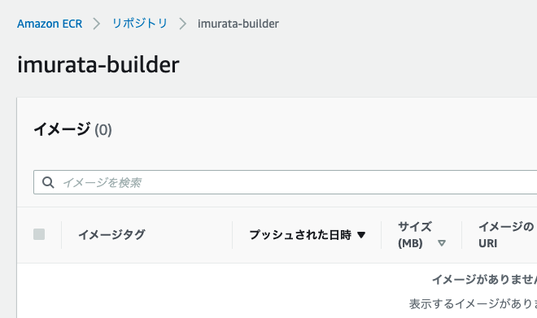
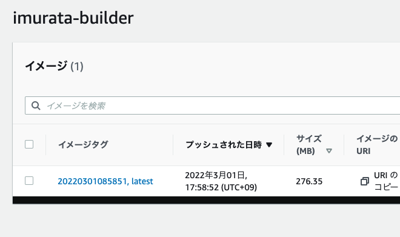
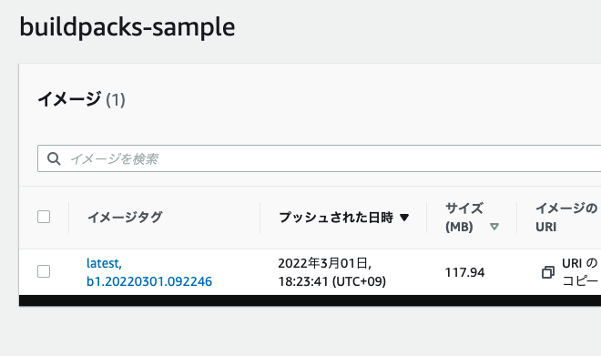

# ゴール
- kp image saveをECRに対して行う
- ECR以外のリポジトリの利用はStack, Storeのみ許可

## ECR参照用のkp secretの作成

ECRの認証情報は12時間でexpireするので、定期的に更新する。
ここではcronjobで更新する。\
cronjobを実行するSAとRole、RoleBindingを作成する。
```
cat <<EOF | kubectl apply -f -
kind: Role
apiVersion: rbac.authorization.k8s.io/v1
metadata:
  namespace: cicd
  name: ecr-cred-helper
rules:
- apiGroups: [""]
  resources:
  - secrets
  - serviceaccounts/token
  - serviceaccounts
  verbs:
  - 'delete'
  - 'create'
  - 'patch'
  - 'get'
  - 'update'
  - 'list'
---
kind: RoleBinding
apiVersion: rbac.authorization.k8s.io/v1
metadata:
  name: ecr-cred-helper
  namespace: cicd
subjects:
- kind: ServiceAccount
  name: sa-ecr-cred-helper
  namespace: cicd
roleRef:
  kind: Role
  name: ecr-cred-helper
  apiGroup: ""
---
apiVersion: v1
kind: ServiceAccount
metadata:
  name: sa-ecr-cred-helper
  namespace: cicd
EOF
```

CronjobとAWSのログイン情報が入ったConfigMapは以下となる。
Cronjob内でkpコマンドを取得し、6時間に一回kp secretを更新する。
```
cat <<EOF | kubectl apply -f -
apiVersion: batch/v1
kind: CronJob
metadata:
  name: ecr-cred-helper
  namespace: cicd
spec:
  concurrencyPolicy: Allow
  failedJobsHistoryLimit: 1
  jobTemplate:
    metadata:
      creationTimestamp: null
    spec:
      template:
        metadata:
          creationTimestamp: null
        spec:
          containers:
          - command:
            - /bin/sh
            - -xc
            - |-
              TOKEN=`aws ecr get-login --region ${REGION} --registry-ids ${ACCOUNT} | cut -d' ' -f6`
              echo "ENV variables setup done."
              export REGION=us-east-1
              export REGISTRY_PASSWORD=$(aws ecr get-login-password --region ${REGION})
              wget https://github.com/vmware-tanzu/kpack-cli/releases/download/v0.4.2/kp-linux-0.4.2
              mv kp-linux-0.4.2 kp
              chmod +x kp
              ./kp secret delete ${SECRET_NAME} -n ${NAMESPACE}
              ./kp secret create ${SECRET_NAME} --registry 375783000519.dkr.ecr.us-east-1.amazonaws.com --registry-user AWS -n ${NAMESPACE}
              kubectl patch serviceaccount ecr-auth-reader -p '{"imagePullSecrets":[{"name":"'$SECRET_NAME'"}]}' -n $NAMESPACE
              echo "All done."
            env:
            - name: NAMESPACE
              value: cicd
            - name: AWS_DEFAULT_REGION
              value: us-east-1
            - name: AWS_SECRET_ACCESS_KEY
              valueFrom:
                configMapKeyRef:
                  key: AWS_SECRET_ACCESS_KEY
                  name: aws-ecr-env
            - name: AWS_ACCESS_KEY_ID
              valueFrom:
                configMapKeyRef:
                  key: AWS_ACCESS_KEY_ID
                  name: aws-ecr-env
            - name: ACCOUNT
              valueFrom:
                configMapKeyRef:
                  key: AWS_ACCOUNT_ID
                  name: aws-ecr-env
            - name: SECRET_NAME
              value: generated-ecr-token
            - name: REGION
              value: us-east-1
            - name: EMAIL
              valueFrom:
                configMapKeyRef:
                  key: EMAIL
                  name: aws-ecr-env
            image: odaniait/aws-kubectl:latest
            imagePullPolicy: IfNotPresent
            name: ecr-cred-helper
            terminationMessagePath: /dev/termination-log
            terminationMessagePolicy: File
          dnsPolicy: Default
          hostNetwork: true
          restartPolicy: Never
          schedulerName: default-scheduler
          serviceAccount: sa-ecr-cred-helper
          serviceAccountName: sa-ecr-cred-helper
          terminationGracePeriodSeconds: 30
  schedule: 0 */6 * * *
  successfulJobsHistoryLimit: 3
  suspend: false
---
apiVersion: v1
kind: ConfigMap
metadata:
  name: aws-ecr-env
  namespace: cicd
data:
  "AWS_SECRET_ACCESS_KEY": "xxxxxxxxxxxx"
  "AWS_ACCESS_KEY_ID": "xxxxxxxx"
  "AWS_ACCOUNT_ID": "375xxxxxx9"
  "EMAIL": "imurata@vmware.com"
EOF
```

## builderからECRを使う
空のリポジトリを用意。\
  

ECRの認証情報が入ったSecretを参照するSAを作成。
```
cat <<EOF | kubectl apply -f -
apiVersion: v1
kind: ServiceAccount
metadata:
  name: ecr-auth-reader
  namespace: cicd
secrets:
- name: generated-ecr-token
imagePullSecrets:
- name: generated-ecr-token
EOF
```

ClusterStoreは以下。
```
cat <<EOF | kubectl apply -f -
apiVersion: kpack.io/v1alpha2
kind: ClusterStore
metadata:
  name: pythonstore
spec:
  sources:
  - image: gcr.io/paketo-buildpacks/java
  - image: gcr.io/paketo-buildpacks/nodejs
  - image: gcr.io/paketo-buildpacks/python
  - image: gcr.io/paketo-buildpacks/go
EOF
```
ClusterStackは以下。
```
cat <<EOF | kubectl apply -f -
apiVersion: kpack.io/v1alpha2
kind: ClusterStack
metadata:
  name: base
spec:
  id: "io.buildpacks.stacks.bionic"
  buildImage:
    image: "paketobuildpacks/build:base-cnb"
  runImage:
    image: "paketobuildpacks/run:base-cnb"
```

Builderは以下。
```
cat <<EOF | kubectl apply -f -
apiVersion: kpack.io/v1alpha2
kind: Builder
metadata:
  name: ecr-builder
  namespace: cicd
spec:
  serviceAccountName: ecr-auth-reader
  tag: 375783000519.dkr.ecr.us-east-1.amazonaws.com/imurata-builder:latest
  stack: 
    name: base
    kind: ClusterStack
  store:
    name: pythonstore
    kind: ClusterStore
  order:
  - group:
    - id: paketo-buildpacks/java
  - group:
    - id: paketo-buildpacks/nodejs
  - group:
    - id: paketo-buildpacks/go
  - group:
    - id: paketo-buildpacks/python
EOF
```
applyしたタイミングで以下のように生成されればOK。\
  

イメージを生成する。

```
kp image save sample-ecr --tag 375783000519.dkr.ecr.us-east-1.amazonaws.com/buildpacks-sample:latest --git git@gitlab.gitlab.unohude.info:devsecops/samples.git --git-revision main --sub-path ./apps/java-maven --builder ecr-builder -n cicd
```
確認する。
```
$ kp build logs sample-ecr | tail
*** Images (sha256:f49b4ecd789936da66a5111db6f447d8cab8882d4022b08bb468908c37b79fc0):
      375783000519.dkr.ecr.us-east-1.amazonaws.com/buildpacks-sample:latest
      375783000519.dkr.ecr.us-east-1.amazonaws.com/buildpacks-sample:b1.20220301.092246
Adding cache layer 'paketo-buildpacks/bellsoft-liberica:jdk'
Adding cache layer 'paketo-buildpacks/syft:syft'
Adding cache layer 'paketo-buildpacks/maven:application'
Adding cache layer 'paketo-buildpacks/maven:cache'
Adding cache layer 'cache.sbom'
===> COMPLETION
Build successful
```
ECR側にも作成されていることが分かる。\
  

Cronjobの動作も確認する。
```
$ k logs ecr-cred-helper-27435480-mjq4p | tail
+ mv kp-linux-0.4.2 kp
+ chmod +x kp
+ ./kp secret delete generated-ecr-token -n cicd
Secret "generated-ecr-token" deleted
+ ./kp secret create generated-ecr-token --registry 375783000519.dkr.ecr.us-east-1.amazonaws.com --registry-user AWS -n cicd
Secret "generated-ecr-token" created
+ kubectl patch serviceaccount ecr-auth-reader -p '{"imagePullSecrets":[{"name":"generated-ecr-token"}]}' -n cicd
serviceaccount/ecr-auth-reader patched (no change)
All done.
+ echo 'All done.'
```
再作成には失敗してなさそう。

お疲れ様でした。

お疲れ様でした。